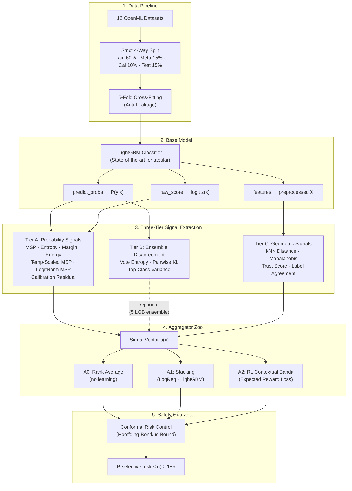

# Reinforcement Learning for Selective Prediction

A rigorous benchmark and novel RL-based aggregation framework for **Selective Prediction** (Learning to Reject) on tabular data. Our system allows ML models to intelligently abstain from uncertain predictions, handing difficult cases to a human or safe fallback.

Instead of relying on a single heuristic like Maximum Softmax Probability (MSP), our **RL Contextual Bandit** learns an optimal abstention policy by aggregating 15+ diverse uncertainty signals across three tiers, wrapped in distribution-free **Conformal Risk Control** guarantees.

---

## 🏗️ Architecture



---

## 📡 Signal Tiers

Our framework extracts uncertainty signals across three complementary tiers. Each tier captures a fundamentally different type of uncertainty.

### Tier A — Probability Signals (Free, Always Available)
Derived directly from the base model's `predict_proba` and `logits`. Zero additional cost.

| Signal | Source | What It Measures |
|---|---|---|
| **MSP** (Geifman 2017) | `1 − max P(y\|x)` | Raw confidence of the top prediction |
| **Entropy** | `−Σ p log p` | Spread of probability mass across classes |
| **Margin (prob)** | `−(p₁ − p₂)` | Gap between top-2 predicted probabilities |
| **Margin (logit)** | `−(z₁ − z₂)` | Gap between top-2 raw logits |
| **Energy** (Liu 2020) | `−logsumexp(z)` | Free energy of the logit vector (mean-centered) |
| **LogitNorm MSP** (Cattelan 2023) | `softmax(z/‖z‖)` | Scale-invariant confidence (multiclass only) |
| **Temp-Scaled MSP** (Guo 2017) | `softmax(z/T)` | Post-hoc calibrated confidence |
| **Calib Residual** | `\|conf − iso(conf)\|` | Local miscalibration gap (non-monotone) |

> **Binary Degeneracy:** On binary tasks (K=2), all Tier A signals are provably rank-equivalent (Spearman ρ = 1.0000). Tier B and C are the only sources of genuinely different orderings.

### Tier B — Ensemble Disagreement (Optional, Cost: 5× Base Training)
Requires training an ensemble of 5 independently-seeded LightGBM models. Captures **epistemic uncertainty** (model disagreement).

| Signal | What It Measures |
|---|---|
| **Vote Entropy** | Entropy of the ensemble's majority-vote distribution |
| **Mean Pairwise KL** | Average KL divergence between all pairs of ensemble members |
| **Top-Class Variance** | Variance of the top-class probability across members |

> **⏱️ Performance Note:** Tier B is disabled by default (`use_ensemble=false`) because it trains 5× more base models. Enable it with `signals.use_ensemble=true` for maximum signal diversity. Running only Tier A+C provides a strong baseline at ~3× faster runtime.

### Tier C — Geometric Signals (Requires Training Set at Inference)
Distance-based signals computed in the base model's feature space. Captures **data-geometry uncertainty** — how far a test point sits from the training manifold.

| Signal | Source | What It Measures |
|---|---|---|
| **kNN Distance** | Mean distance to k nearest training points | Proximity to training data |
| **Local Label Agreement** | Fraction of k neighbours sharing predicted label | Local aleatoric ambiguity |
| **Trust Score** (Jiang 2018) | `d(other class) / d(predicted class)` | Geometric class separation |
| **Mahalanobis** (Lee 2018) | Mahalanobis distance to predicted class centroid | Distributional distance |

---

## 🤖 Aggregator Families

Three families of aggregators compete to combine the signal vector `u(x)` into a single abstention score.

| Family | Method | Learning | Description |
|---|---|---|---|
| **A0** | Rank Average | None | Mean rank across signals. Sanity-check baseline. |
| **A1** | Logistic Regression | Supervised | L2-regularised LogReg on `u(x)` → `P(error)` |
| **A1** | LightGBM Stacking | Supervised | GBM meta-learner on `u(x)` → `P(error)` |
| **A2** | MLP (BCE) | Supervised | 2-layer MLP with binary cross-entropy loss |
| **A2** | MLP (Soft Risk) | Supervised | MLP with quantile-gated selective risk losses |
| **A2** | **RL Contextual Bandit** | **RL** | **MLP trained on Expected Reward of abstention** |
| **A2** | **Linear RL Bandit** | **RL** | **Single linear layer + RL loss (ablation)** |
| **A2** | Adaptive Gating | Supervised | MLP with learned gating threshold |

### The RL Expected Reward Loss (Our Core Contribution)
```
E[Reward] = π(predict) × (1[correct] − c × 1[incorrect])
```
The RL agent learns a policy `π` that maximizes expected reward. If it predicts and gets it right, it earns `+1`. If it predicts and gets it wrong, it pays a penalty of `−c`. The penalty parameter `c` controls the risk-reward tradeoff: higher `c` → more conservative abstention.

---

## 🛡️ Anti-Leakage Design

| Protection | What It Prevents |
|---|---|
| **4-Way Disjoint Split** | Train/Meta/Cal/Test never overlap (unit-tested) |
| **5-Fold Cross-Fitting** | Signal vectors are always out-of-sample |
| **Per-Fold Seeds** | Each fold model gets `seed * 1000 + fold` |
| **Column-Count Assertion** | Meta and test signal matrices must have identical features |
| **Temporal Split** | `electricity` uses chronological order, never shuffled |

---

## 📊 Datasets

All datasets are pulled from **OpenML** by numeric ID — not hand-assembled, not cherry-picked. Following the standard tabular evaluation protocol of Grinsztajn et al. (NeurIPS 2022).

| Dataset | OpenML ID | Rows | Features | Classes | Task Type |
|---|---|---|---|---|---|
| `adult` | 1590 | 48,842 | 14 | 2 | Binary |
| `german_credit` | 31 | 1,000 | 20 | 2 | Binary |
| `electricity` | 151 | 45,312 | 8 | 2 | Binary (Temporal) |
| `wine_quality_white` | 40498 | 4,898 | 11 | 7 | Multiclass |
| `letter` | 6 | 20,000 | 16 | 26 | Multiclass |
| `satimage` | 182 | 6,430 | 36 | 6 | Multiclass |
| `phoneme` | 1489 | 5,404 | 5 | 2 | Binary |
| `bank_marketing` | 1461 | 45,211 | 16 | 2 | Binary |
| `nomao` | 1486 | 34,465 | 118 | 2 | Binary |
| `kr_vs_kp` | 3 | 3,196 | 36 | 2 | Binary |
| `eeg_eye_state` | 1471 | 14,980 | 14 | 2 | Binary |
| `magic_telescope` | 1120 | 19,020 | 10 | 2 | Binary |

---

## 🔬 Statistical Methodology

| Test | Purpose |
|---|---|
| **Wilcoxon Signed-Rank** | Paired comparison of each method vs MSP baseline (paired by seed) |
| **Holm-Bonferroni Correction** | Multiple-comparisons correction within each dataset |
| **Friedman Test + Mean Ranks** | Non-parametric blocked test across all datasets |
| **Conformal Risk Control** | Distribution-free guarantee: `P(risk ≤ α) ≥ 1−δ` via Hoeffding-Bentkus bound |

---

## 💻 Quickstart (Google Colab)

```bash
# 1. Clone and install
!git clone https://github.com/yashs00/RL-Selective-Prediction.git
%cd RL-Selective-Prediction
!pip install hydra-core omegaconf openml lightgbm xgboost

# 2. Run experiment (10 seeds, Tier A+C — fastest)
!python scripts/run_all.py dataset=wine_quality_white experiment.n_seeds=10

# 3. (Optional) Enable Tier B ensemble signals for maximum performance
!python scripts/run_all.py dataset=wine_quality_white experiment.n_seeds=10 signals.use_ensemble=true

# 4. Generate tables and statistical tests
!python scripts/make_tables.py --tiers "AC"
```

---

## 📂 Repository Structure

```
├── configs/                    # Hydra config (dataset, model, signals, experiment)
├── scripts/
│   ├── run_all.py              # Main experiment entry point
│   └── make_tables.py          # AURC tables, Wilcoxon tests, Friedman ranks
├── src/
│   ├── aggregators/
│   │   ├── a0_rank.py          # A0: Rank average (no learning)
│   │   ├── a1_stacking.py      # A1: LogReg + LightGBM stacking
│   │   ├── a2_coverage_loss.py # A2: MLP, RL Bandit, Linear RL, Adaptive Gating
│   │   └── losses.py           # Expected reward, soft selective risk, BCE
│   ├── conformal/
│   │   └── risk_control.py     # Hoeffding-Bentkus conformal threshold selection
│   ├── data/
│   │   ├── loaders.py          # OpenML dataset registry and caching
│   │   └── splits.py           # 4-way split + cross-fitting
│   ├── experiment/
│   │   └── runner.py           # Full experiment orchestration
│   ├── metrics/
│   │   └── selective.py        # AURC, E-AURC, ECE, risk-at-coverage
│   ├── models/
│   │   └── lightgbm_model.py   # LightGBM wrapper with logits + features
│   └── signals/
│       ├── tier_a.py           # 8 probability-derived signals
│       ├── ensemble.py         # 3 ensemble disagreement signals (Tier B)
│       └── tier_c.py           # 4 geometric distance signals
├── tests/                      # Unit tests for splits, metrics, conformal bounds
└── results/                    # Output parquet + raw per-instance scores
```

---

## 📚 References

* Geifman & El-Yaniv (2017). *Selective Classification for Deep Neural Networks.* NeurIPS.
* Liu et al. (2020). *Energy-based Out-of-distribution Detection.* NeurIPS.
* Lee et al. (2018). *A Simple Unified Framework for Detecting OOD Samples and Adversarial Attacks.* NeurIPS.
* Jiang et al. (2018). *To Trust Or Not To Trust A Classifier.* NeurIPS.
* Guo et al. (2017). *On Calibration of Modern Neural Networks.* ICML.
* Angelopoulos et al. (2022). *Conformal Risk Control.*
* Grinsztajn et al. (2022). *Why do tree-based models still outperform deep learning on typical tabular data?* NeurIPS.
* Cattelan & Silva (2023). *LogitNorm: Rethinking the Approach of Confidence Estimation.*
