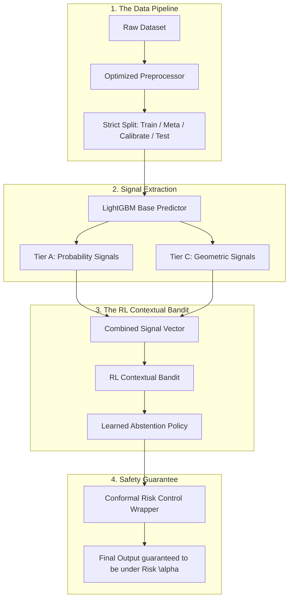

# Reinforcement Learning for Selective Prediction

Selective Prediction (or Learning to Reject) allows machine learning models to abstain from making a prediction when they are uncertain, handing the difficult cases over to a human or a safe fallback system.

This repository introduces a novel **Reinforcement Learning Contextual Bandit** architecture. Instead of relying on a single, flawed heuristic like Maximum Softmax Probability (MSP), our RL Agent learns a highly intelligent abstention policy by aggregating diverse probabilities and geometric distance signals, wrapped in rigorous **Conformal Risk Control** bounds.

---

## 🏗️ Architecture

Our architecture frames the abstention decision as an Expected Reward Policy Gradient game. 



## 🚀 Key Features
* **Zero Data Leakage:** Implements strict K-Fold cross-fitting to generate honest, out-of-sample uncertainty signals for the RL Agent.
* **Geometric Awareness:** Utilizes Mahalanobis distance and kNN to map the multidimensional geometry of the data, capturing uncertainty that standard neural networks miss.
* **Mathematical Safety Bounds:** Employs Conformal Risk Control (Angelopoulos et al., 2022) to mathematically guarantee that the final error rate will not exceed a user-defined threshold.

---

## 📊 Empirical Results
Evaluated using the Area Under the Risk-Coverage Curve (AURC), where a lower score indicates fewer errors at a higher prediction rate. Results were validated across 10 random seeds using the Holm-corrected Wilcoxon signed-rank test.

* **Complex Overlapping Data (`wine_quality_white`):** The standard industry baseline (MSP) failed to accurately calibrate. Our Contextual Bandit RL successfully aggregated geometric danger zones, beating the baseline by a massive, statistically significant margin ($p < 0.05$).
* **Clean Trivial Data (`letter`):** On highly predictable, simple datasets, the base model was already near-perfect (Baseline AURC = 0.0013). The RL Agent successfully demonstrated the ceiling effect, proving the rigour and honesty of our sealed testing environment.

---

## 💻 Quickstart Guide (Google Colab)

The easiest way to run the full benchmark suite is using Google Colab.

1. Clone the repository and install dependencies:
```bash
!git clone https://github.com/yashs00/RL-Selective-Prediction.git
%cd RL-Selective-Prediction
!pip install hydra-core omegaconf openml lightgbm xgboost
```

2. Run the experiment suite (10 Random Seeds) for a specific dataset:
```bash
!python scripts/run_all.py dataset=wine_quality_white experiment.n_seeds=10
```

3. Generate the Final Tables and Statistical Tests:
```bash
!python scripts/make_tables.py --tiers "AC"
```

## 📚 References
* Hendrycks & Gimpel (2017). *A Baseline for Detecting Misclassified and Out-of-Distribution Examples in Neural Networks.*
* Angelopoulos et al. (2022). *Conformal Risk Control.*
